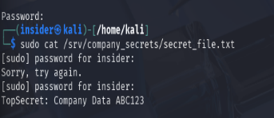

# 🚨 Malicious Insider Incident Response Report  
### Privilege Escalation & Data Theft in Kali Linux Lab  
**Author:** Shrutha Keerthana  
**Date:** September 1, 2025

---

## Executive Summary

This report documents a simulated malicious insider attack within a Kali Linux environment. It covers setup, attack simulation, forensic investigation, remediation steps, and security recommendations to mitigate insider threats.

---

## Table of Contents

- [1. Lab Setup & Baseline Security](#1-lab-setup--baseline-security)  
- [2. Attack Simulation & Exploitation](#2-attack-simulation--exploitation)  
- [3. Forensic Investigation & Evidence](#3-forensic-investigation--evidence)  
- [4. Remediation & Recovery Measures](#4-remediation--recovery-measures)  
- [5. Recommendations & Best Practices](#5-recommendations--best-practices)  
- [6. Lessons Learned](#6-lessons-learned)  

---

## 1. Lab Setup & Baseline Security

Two users were created:

| User    | Role         | Groups                |
|---------|--------------|-----------------------|
| manager | Privileged   | sudo, manager, users  |
| insider | Regular User | users                 |

A sensitive file was created:

ls -l /srv/company_secrets

text

**Figure 1:** Initial file permissions and ownership.  

---

## 2. Attack Simulation & Exploitation

- Insider tries to access secret file; access denied.  
- Attempts to escalate privileges using `sudo`.  
- Admin adds insider to sudo group.  
- Insider accesses secret file successfully.

Click to view Insider Attack Flow Diagram

flowchart TD
A[Insider Tries Access] -->|Permission Denied| B[Attempts Privilege Escalation]
B --> C{Added to sudo group?}
C -->|No| D[Failed Attempts]
C -->|Yes| E[Successful Sudo Access]
E --> F[Access Secret File]

text

**Figure 2:** Insider initial failed access (permission denied).  

**Figure 3:** Insider created with useradd commands.  

**Figure 4:** Password set for users.  

**Figure 5:** Sudo privilege escalation attempts.  

**Figure 6:** Insider’s `.bash_history` showing commands executed.  

**Figure 7:** Insider added to sudo group confirmed by groups command.  

**Figure 8:** Login sessions verified.  

**Figure 9:** Insider accesses secret file with sudo.  

---

## 3. Forensic Investigation & Evidence

Investigation encompassed:

- Tracking insider’s `.bash_history` for malicious commands.
- Verifying group changes post-escalation.
- Checking login sessions correlating with attack timeline.

The `auth.log.sample` file captures critical authentication and privilege escalation activities during the insider attack simulation. It shows the insider user opening multiple sudo sessions to execute root-level commands, including launching a root shell and adding themselves to the sudo group. The log also records a failed SSH authentication attempt followed by a successful login, highlighting persistence efforts. Subsequently, the insider accesses the sensitive file with elevated privileges. Finally, the log records the administrator removing the insider from the sudo group, marking the remediation phase. These detailed log entries provide a clear timeline of the attack and mitigation efforts critical for forensic analysis and understanding the incident’s progression.

---

## 4. Remediation & Recovery Measures

- Insider removed from sudo group:  
sudo deluser insider sudo

text
- File ownership and permissions restored:  
sudo chown manager:manager /srv/company_secrets/secret_file.txt
sudo chmod 640 /srv/company_secrets/secret_file.txt

text
- Insider’s password reset:  
sudo passwd insider

text

**Figure 10:** Remediation commands and outputs.  

---

## 5. Recommendations & Best Practices

- Enforce least privilege access.  
- Enable comprehensive logging with auditd/rsyslog.  
- Regular audits of user privileges and groups.  
- Strong password and session monitoring policies.  
- Deploy insider threat detection systems for realtime alerts.

---

## 6. Lessons Learned

- Insider threat detection requires auditing and monitoring.  
- Forensic artifacts such as shell history and logins are key.  
- Rapid remediation minimizes damage.  
- Defense-in-depth reduces risk of privilege escalation.
